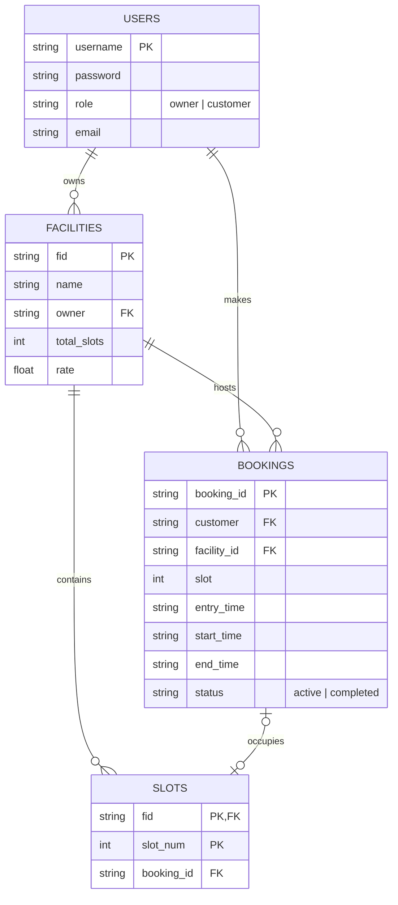

# 🚗 Park IT — Smart Parking Management System

Park IT is a lightweight, responsive web application built with **Flask** and **SQLite3** designed to make parking slot reservation and management seamless for both **Facility Owners** and **Customers**. 

---

## ✨ Key Features

### 👤 Role-Based Portals

#### 🏢 For Facility Owners
* **Dashboard Control**: View and monitor all owned parking facilities in one place.
* **Facility Creation**: Instantly register new parking facilities, defining the total number of slots and custom hourly rates.
* **Live Slot Monitoring**: Inspect facility-specific grids showing real-time occupancy, slot statuses, and customer booking details.
* **Facility Management**: Delete existing facilities with automated cascade handling of active bookings and slots.

#### 🚙 For Customers
* **Interactive Dashboard**: Track active bookings, estimated costs, and slot information.
* **Real-time Facility Search**: Search for parking facilities by name and see available slots dynamically.
* **Smart Booking System**: Select start/end time windows for automated, consecutive free-slot assignment.
* **Automatic Email Receipts**: Receive detailed HTML booking confirmations with slot details and estimated cost breakdown.
* **Instant Space Release**: End active parking sessions with immediate receipt generation detailing the total duration and final fee.

---

## 🛠️ Tech Stack

* **Backend**: Python 3, Flask
* **Database**: SQLite3 (with SQL foreign key enforcement enabled)
* **Frontend**: HTML5, Vanilla CSS, Responsive Grid layouts
* **Communication**: SMTP (Standard Library `smtplib`) for HTML transactional emails

---

## 💾 Database Schema

The database consists of four core tables:



---

## 🚀 Getting Started

### Prerequisites
* Python 3.8 or higher installed on your local machine.

### Installation

1. **Clone or download the project** directory to your local machine.
2. **Navigate** into the project folder:
   ```bash
   cd "Parking System"
   ```
3. **Install dependencies**:
   ```bash
   pip install -r requirements.txt
   ```

### 📧 SMTP Email Configuration (Optional)
To enable real-time booking confirmation emails to customers, set the following environment variables:
```bash
export SMTP_EMAIL="your-email@gmail.com"
export SMTP_PASSWORD="your-app-password" # e.g., Google App Password
export SMTP_SERVER="smtp.gmail.com"       # Optional (defaults to smtp.gmail.com)
export SMTP_PORT=587                      # Optional (defaults to 587)
```
*Note: If these variables are not configured, email sending will be skipped gracefully, and a message will be printed to the server console.*

### Running the Application

You can start the server using the provided shell script:
```bash
chmod +x run.sh
./run.sh
```
Or run it directly with Python:
```bash
python app.py
```

Once started, the application will run on **`http://127.0.0.1:5001`**.

---

## 📂 Project Structure

```text
├── app.py              # Main Flask application logic, helper methods, and routes
├── parkit.db           # SQLite3 database (automatically generated on first run)
├── requirements.txt    # Application package dependencies
├── run.sh              # Bash script to run the local server on port 5001
├── procfile            # Production process configuration
├── static/
│   └── parking_bg.png  # Hero background asset
└── templates/          # HTML views for dashboard, booking, searching, and receipt
    ├── index.html            # Registration & Login portal
    ├── owner.html            # Facility Owner Dashboard
    ├── facility_detail.html  # Live slot grid and booking history
    ├── customer.html         # Customer Dashboard and active reservations
    ├── search.html           # Real-time facility search and booking interface
    └── receipt.html          # Dynamic checkout receipt screen
```
